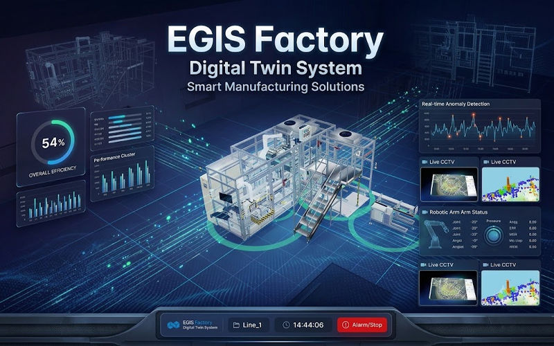

# EGIS Factory · Digital Twin System



HPG 충전 라인을 그대로 옮긴 **스마트팩토리 디지털 트윈** 데모입니다.
백엔드 없이 어디서든 도는 정적 빌드 안에서 — 3D 공정 애니메이션, 라인 관제,
몬테카를로 생산 예측, 설비 보전, 품질 관리, 실설비(OPC-UA) 연동 경로까지
공장 운영의 한 사이클을 통째로 시뮬레이션합니다.

**▶ 라이브 데모: https://seongyoru.github.io/CustomFactory/**

| 데모 계정 | PIN | 권한 |
|---|---|---|
| 관리자 | `0000` | 전체 (배치 조정·데이터 소스·초기화) |
| 운영자 | `1111` | 생산 조작 (로트·교체·알람 해제·E-STOP 해제) |
| 게스트 | `2222` | 모니터링 전용 |

## 주요 기능

**3D 디지털 트윈**
- CAD 원본(GLB, Draco 압축)을 조립 좌표 그대로 로드한 2개 라인 + 공장 셸
- 키프레임 명세 기반 공정 애니메이션 — 컨베이어 적재(최대 20개) → 이재 로봇 → 절단 → 폴리 로봇 충전 → 실린더 4회 만충 반출, 로트 택트타임에 재생 속도가 실시간 동기화
- 설비 클릭 → 상세 패널(실시간 센서·병목 분석·점검 이력·메모), 기즈모 배치 조정

**생산 운영 (로트 기반)**
- 작업지시 = 품목 + 수량, 표준시간은 애니메이션 타임라인에서 유도
- 라인별 독립 대기열·진행률·E-STOP, 엑셀 업로드, 드래그 순서 변경
- 교대(2교대) 실동작, 일일 목표 대비 달성 게이지, 교대 인수인계 노트

**전체 현황 관제 뷰**
- 라인 카드: 상태·진행률·완료 예정(ETA)·실린더·OEE 게이지·생산 스파크라인·최저 소모품·활성 알람·전력
- 공장 합계 밴드: 금일 총생산(목표 대비)·평균 OEE·금일 전력(CO₂ 환산)·알람·소모품 위험

**라인 시뮬레이션 (몬테카를로 2,000회)**
- 완료 시각 분포(P50/P90/히스토그램), 납기 달성 확률, 병목 개선 민감도, 소모품 소진 리스크, SPT 정렬 제안
- 결과 스냅샷 저장 → 리포트에서 계획끼리 Δ 비교

**설비 보전**
- 소모품이 생산량에 비례해 실제로 마모 — 15% 주의 승격, 5% 자동 알람, 교체 워크플로(이력·감사 기록)
- 알람 이벤트 기반 MTTA/MTTR/MTBF 지표

**품질**
- 로트 완료 시 불량 유형 배분 → 파레토 차트(누적 점유·80% 기준선)
- 불량률 관리도(p-차트 근사, 평균·UCL·초과점 강조)

**알람 · 리포트**
- 다중 알람 큐(설비당 1건 코얼레싱) + 알림 센터, 3D 하이라이트·센서 급등 연동
- 리포트 센터 5탭(생산/보전/시뮬레이션/알람/감사) + 엑셀 다중 시트 + 일일 보고서 인쇄(브라우저 PDF 저장)

## 아키텍처

```
                         ┌─ 시뮬레이션 소스 (기본, 내장)
브라우저 SPA ── 소스 인터페이스 ┤
  │                      └─ OPC-UA 게이트웨이 (ws://) ── gateway/server.js ── opc.tcp:// PLC
  ├─ localStorage (egis-dt.v3.*) ──(선택)── gateway/persist-server.js  ← 부팅 선주입 + write-through
  └─ CCTV: 데모 mp4 루프 ──(선택)── HLS(.m3u8) 실스트림 (hls.js 동적 로드)
```

- **화면 코드는 소스를 모른다** — 텔레메트리·알람·저장·영상 모두 교체 가능한 인터페이스 뒤에 있어, 시뮬레이션 ↔ 실설비 전환이 설정 한 줄입니다.
- `gateway/` 는 참조 구현: OPC-UA↔WebSocket 중계 + 데모 PLC + 자가검증(대시보드의 실제 파서로 프레임 검증) + 파일 기반 서버 저장소. 자세한 사용법은 [gateway/README.md](gateway/README.md).

## 실행

```bash
npm install
npm run dev        # http://localhost:5173
npm test           # vitest 98건
npm run build      # 정적 빌드 (base './' — 아무 하위 경로에나 배포 가능)
```

실설비 경로 시연(PLC 없이):

```bash
cd gateway && npm install
npm run demo-plc   # 가짜 PLC (opc.tcp://localhost:4840/egis)
npm run opcua      # 게이트웨이 (ws://localhost:8125) → 대시보드 데이터 소스 설정에 입력
```

## 기술 스택

React 19 · Vite · Tailwind CSS 4 · react-three-fiber / three.js (Draco) ·
node-opcua · vitest — 차트·게이지는 전부 수제 SVG(외부 차트 라이브러리 없음).

## 문서

- [docs/WORKLOG.md](docs/WORKLOG.md) — 요청 → 대응 → 검증 순의 전체 작업 이력
- [docs/UPGRADE-2026-08-21.md](docs/UPGRADE-2026-08-21.md) — 상용화 1차 업그레이드 설계 노트

> 본 프로젝트는 시뮬레이션 기반 데모입니다. 에너지(3상 380V·역률 0.85)·불량 유형·마모율
> 등 유도 값의 가정은 화면과 코드 주석에 명시되어 있으며, 실측 연동 시 해당 지점만 교체합니다.
